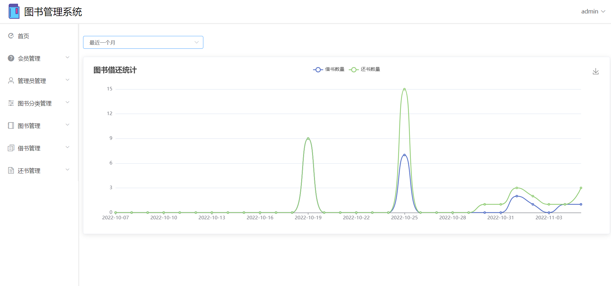
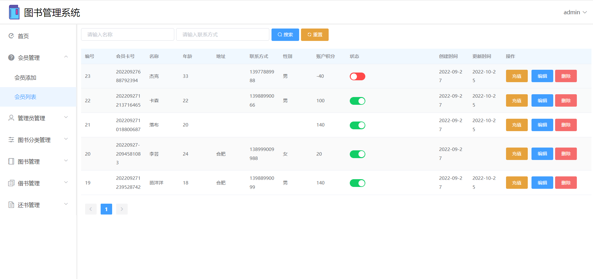

# 从0开始做前后端分离的图书管理系统

技术栈：SpringBoot2 + Vue2.0 + ElementUI + Mysql

免费开源，完全手写，适合小白，求求 <b style="color=red">Star</b>

## B站搜：程序员青戈，手把手带你做计算机毕设！

## 毕业设计、课程设计项目定制可以加我V: xia_qing2012，代码纯手撸，安全靠谱，可讲解、可包文档。

[课程笔记点这里](文档/笔记.md)

关注B站：[程序员青戈](https://space.bilibili.com/402779077) ，学习更多干货教程

关注微信公众号：Java学习指南，回复：软件，获取课程所需的所有软件下载和安装教程。

## 交流学习
+up微信：xia_qing2012，拉你进微信交流群

## 知识星球
关于本项目的任何问题都可以在我的知识星球进行提问，你会得到1对1的解答服务 → <a href="https://t.zsxq.com/08x4zzHWo">戳我加入</a>

## 系统登录

http://localhost:8080/login

账号：admin/admin

## 系统功能

## 系统截图

## 老铁，白嫖完了，真的别忘了 Star 噢！

